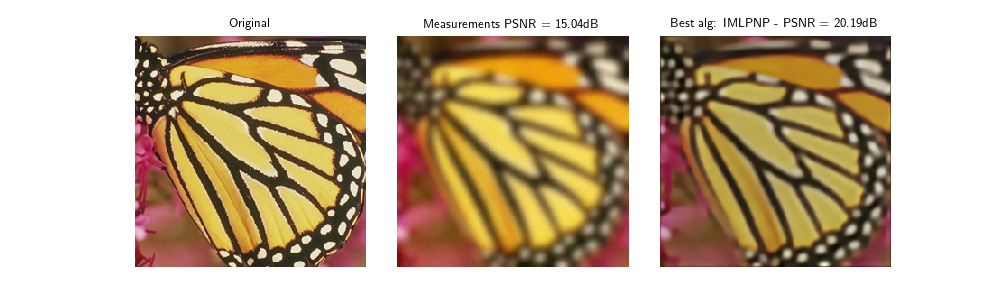
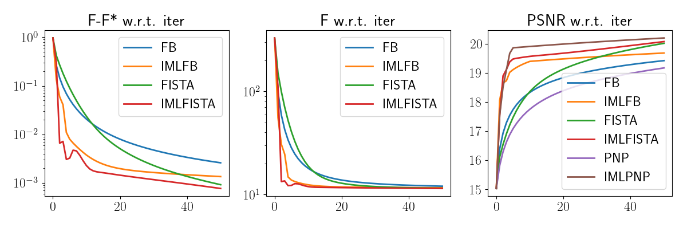

IML FISTA : a multilevel algorithm for image restoration
========================================================
|Python 3.9+|

This repository contains a :code:`python` version of the algorithm proposed in [1]_. The purpose of this repository is the comparison of several multilevel algorithms with their single level counterpart. Standard algorithms are implemented to solve the following problem:

$$\\min_{x} \\frac{1}{2} \\Vert Ax - b \\Vert_2^2 + \\lambda \\Vert \\mathrm{TV}(x)\\Vert_{1,2}$$

Algorithms implemented:

- FB (Forward-Backward): proximal gradient descent method
- FISTA (Fast Iterative Shrinkage-Thresholding Algorithm)
- IMLFB (Inexact Multilevel Forward-Backward)
- IMLFISTA (Inexact Multilevel FISTA)

To solve the plug and play equivalent of this problem, where the total variation is replaced by a learned denoiser, algorithms implemented are:

- PNP (Plug and Play Forward-Backward)
- IMLPNP (Multilevel Plug and Play Forward-Backward)

For the definition of IMLPNP we used the same principles than for IMLFB or IMLFISTA [1]_. See [2]_ for a more comprehensive study of the multilevel plug and play framework.

Set-up
-------
To create the environment with the required packages:

.. code-block:: bash

    $ git clone https://github.com/laugaguillaume/IMLFISTA.git
    $ conda env create -f environment.yml
    $ conda activate imlfista

Quick start
-----------
With the script :code:`demo_minimal.py` you can quickly compare the algorithms on your preferred image, with the linear degradation of your choice. Run the following in command line to see a complete comparison of all the algorithms

.. code-block:: bash

    $ python3 demo_minimal.py

Tutorial
--------
This script :code:`demo_minimal.py` is arranged as follows: load an image

.. code-block:: python

    # Load image from deepinv
    x = dinv.utils.load_url_image(url=dinv.utils.get_image_url("butterfly.png"), img_size=256).to(device)
    # Reduce image size for testing
    x = x[:, :, ::4, ::4]

with the linear degradation of your choice from `DeepInverse <https://deepinv.github.io/deepinv/index.html>`_ specifically `Operator & Noise <https://deepinv.github.io/deepinv/user_guide/physics/physics.html>`_:

.. code-block:: python

    # Define linear operator
    filter_0 = dinv.physics.blur.gaussian_blur(sigma=(4, 4), angle=0.0)
    physics = dinv.physics.Blur(filter_0, device=device, padding='reflect', noise_model=dinv.physics.GaussianNoise(0.01))

Then choose the algorithm to compare by modifying this snippet of code. If you want to compare Forward-Backward to its multilevel version IML Forward-Backward:

.. code-block:: python

    # run 
    with torch.no_grad():
        init = back.clone()
        F_init, PSNR_init = model.compute_metrics_at_init(init)
        x_hat, F_min, PSNR_hat   = model.compute_minimum(init)
        init = back.clone()
        x_IMLFB, metrics_IMLFB = model.IMLFB(init)
        init = back.clone()
        x_FB, metrics_FB = model.FB(init)

Then metrics will be displayed by 

.. code-block:: python

    PlotSLvsML(x, y, F_init, PSNR_init, x_hat, F_min, PSNR_hat, x_FB=x_FB, metrics_FB=metrics_FB, x_IMLFB=x_IMLFB, metrics_IMLFB=metrics_IMLFB)

If you want to add an other algorithm simply add it inside:

.. code-block:: python

    # run 
    with torch.no_grad():
        init = back.clone()
        F_init, PSNR_init = model.compute_metrics_at_init(init)
        x_hat, F_min, PSNR_hat   = model.compute_minimum(init)
        init = back.clone()
        x_IMLFB, metrics_IMLFB = model.IMLFB(init)
        init = back.clone()
        x_FB, metrics_FB = model.FB(init)
        init = back.clone()
        x_IMLFISTA, metrics_IMLFISTA = model.IMLFISTA(init)

without forgetting to add the new metrics to the plot function like:
.. code-block:: python

    PlotSLvsML(x, y, F_init, PSNR_init, x_hat, F_min, PSNR_hat, x_FB=x_FB, metrics_FB=metrics_FB, x_IMLFB=x_IMLFB, metrics_IMLFB=metrics_IMLFB, x_IMLFISTA=x_IMLFISTA, metrics_IMLFISTA = metrics_IMLFISTA)

Changing the settings of the multilevel algorithms
----------------------------------------------------
The parameters of the multilevel algorithms are hard-coded in :code:`minimal_wrapper.py`. This configuration was used in [1]_. If you want to change anything, it should be easier to do it inside :code:`demo/demo_multilevel.py` or in :code:`demo/demo_multilevel_fista.py` where the parameters are passed as arguments. Notably if you want to try other regularizations such as wavelet transform or try other learned denoisers, see :code:`demo/demo_multilevel.py`.

You can solve the following problems with the current implementation:

- Reconstruction with Wavelet regularization

$$\\min_{x} \\frac{1}{2} \\Vert Ax - b \\Vert_2^2 + \\lambda \\Vert \\mathrm{W}(x)\\Vert_{1,2}$$

- Reconstruction with learned denoiser

For other problems, you will need to adapt the multilevel algorithm so that a Moreau envelope of the regularization you want to use is computable in :code:`multilevel/multilevel.py` with the class :code:`Residual`.

Information transfer operators
------------------------------

If you want to change the filter used in the information transfer operator, add it to :code:`multilevel/info_transfer.py` by creating anew class:

.. code-block:: python

    class Gaussian:
        def __str__(self):
            return 'gaussian'

        def get_filter(self):
            k0 = torch.tensor([0.0001, 0.0334, 0.3328, 0.8894,
                            0.8894, 0.3328, 0.0334, 0.0001])
            return k0

and add its name under the list of filters in 

.. code-block:: python

    filter_classes = {
        'gaussian': Gaussian,
    }

References
----------

.. [1] G. Lauga, E. Riccietti, N. Pustelnik, P. Gonçalves, "IML FISTA: A Multilevel Framework for Inexact and Inertial Forward-Backward. Application to Image Restoration", SIAM Journal on Imaging Sciences, 2024. https://arxiv.org/abs/2304.13329

.. [2] N. Laurent, J. Tachella, E. Riccietti, N. Pustelnik. "Multilevel Plug-and-Play Image Restoration", 2025. https://hal.science/hal-05004914/